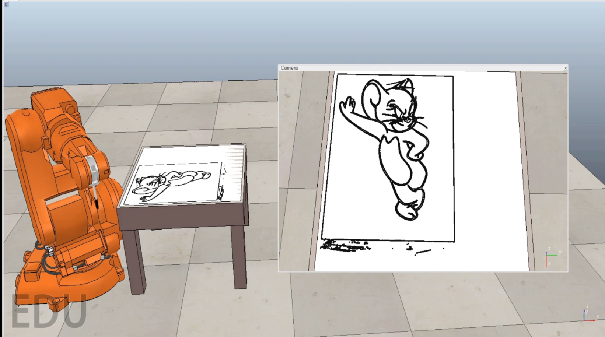
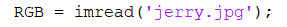
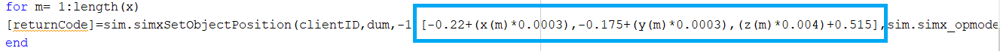

# drawing-robot-in-V-REP-2
Drawing robot in V-REP 

Check this repository to understand simulation: [here](https://github.com/Hrithik-verma/drawing-robot-in-V-REP) 

Difference between previous repository and this is draw a diferent drawing rest all are same only some changes in MATLAB code 

Difference in MATLAB code -

Input picture is different 

Scale factor for drawing is different than previous repository simulation ([here](https://github.com/Hrithik-verma/drawing-robot-in-V-REP) )
